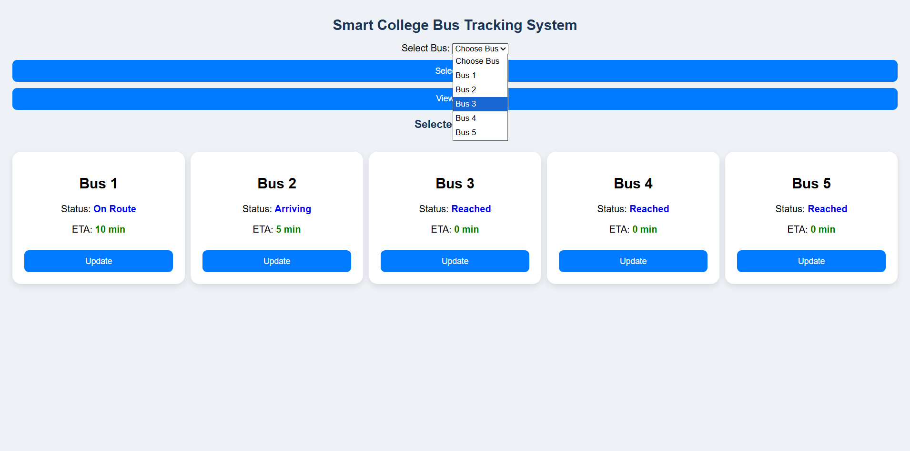
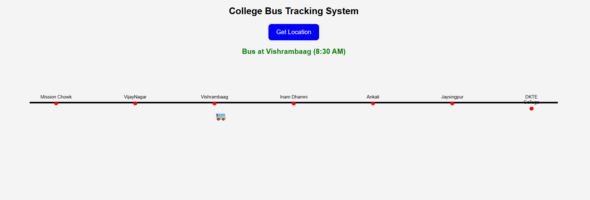
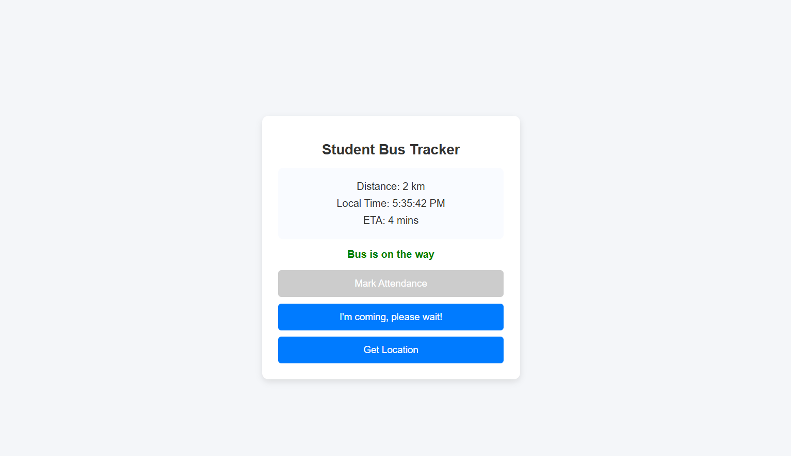
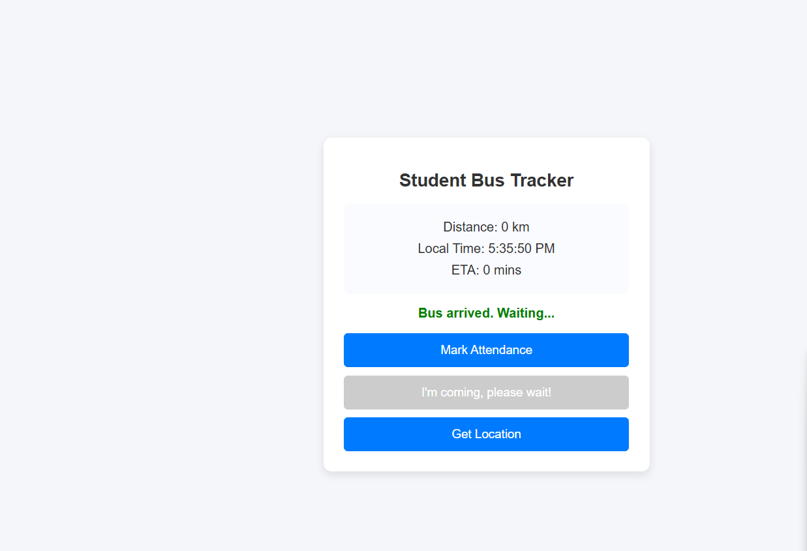
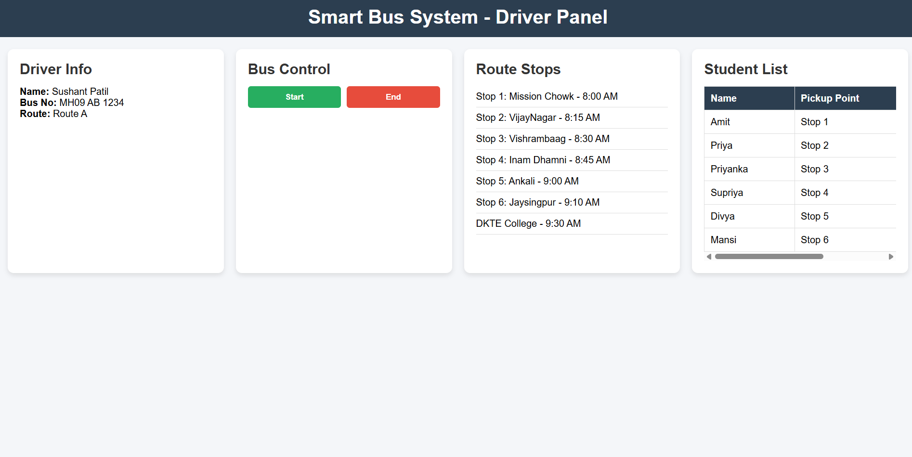

# Smart College Bus Management System

## Overview

A role-based web application developed to simplify and digitize college transportation management for students, drivers, and administrators.

## Features

- Student login
- Driver login
- Admin dashboard
- Simulated real-time (gps) bus tracking
- Attendance management
- Route information

## Technologies Used

- HTML
- CSS
- JavaScript

## Future Enhancements

- GPS Integration
- Mobile and Web based Application
- Live Notifications

  ## Screenshots

### Admin Page

### Location Page

### Student Page

### Driver Page

